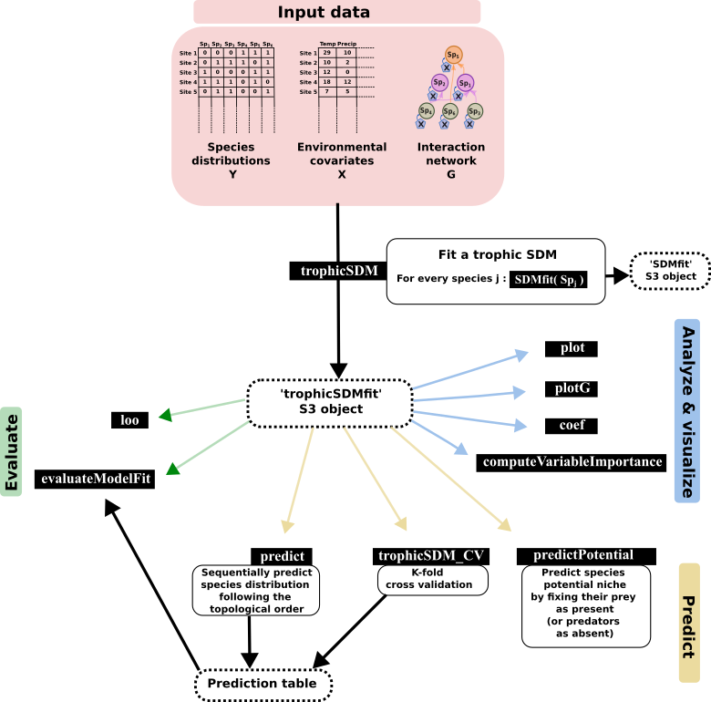

```{r chunk-name, include=FALSE}
knitr::opts_chunk$set(
  collapse = TRUE,
  fig.path = "man/figures/"
)
```
# 
```{r setup, include=FALSE}
knitr::opts_chunk$set(echo = TRUE)
```

# webSDM - including known trophic interactions in SDM

webSDM implements the trophic SDM model described in Poggiato et al., "Integrating trophic food webs in species distribution models improves ecological niche estimation and prediction". Trophic SDM integrate a known trophic interaction network in SDM, thus providing more realistic and ecologically sound predictions. We here after present a quick introduction to some of the feature of the package, but we refer to the vignettes and the help functions for a more complete documentation of our package.

## 'webSDM' map

# 


## Installing the R package

```{r, warning = FALSE, results = 'hide', message = FALSE, echo= TRUE}
# Run to install webSDM
install.packages('webSDM', repos = "http://cran.us.r-project.org")
library(webSDM)
library(ggplot2)
library(rstanarm)
```

## Fit a trophic SDM to data

Fitting a trophic SDM require the species distribution data, the environmental covariates and a known trophic interaction network.  
We load a simulated datasets, where Y contains the species distribution data (a site x species matrix), X the environmental covariates (a sites x covariates matrix) and G is an `igraph` object describing the interaction network (with links going from predators to prey). We specify, for every species, a quadratic relationship with respect to the environment, and we fit a model assuming bottom-up control (i.e., predators are modeled as a function of preys). We fit the trophicSDM in the Bayesian framework.
```{r,warning=FALSE,results='hide'}
data(X, Y, G)

m = trophicSDM(Y = Y, X = X, G = G, env.formula = "~ X_1 + X_2",
               family = binomial(link = "logit"),
               mode = "prey", method = "stan_glm")
```
### Inferred coefficients
We can see the formula of each glm in the argument `$form.all`
```{r,warning=FALSE}
m$form.all
```

We can have a first look to regression coefficients using the function `plot`.
```{r,warning=FALSE,results='hide'}
plot(m)
```

We can access to the regression coefficients (eventually standardised) with the function `coef`.
``` {r}
coef(m, standardise = T, level = 0.9)
```

We can visualise the biotic coefficients with the function `plotG_inferred`
```{r,warning=FALSE,results='hide'}
plotG_inferred(m)
```

We can also visualise the importance of each (set of) variable with the function `computeVariableImportance'
```{r varImpo}
VarImpo = computeVariableImportance(m, 
                                    groups = list("Abiotic" = c("X_1","X_2"),
                                                  "Biotic" = c("Y1","Y2", "Y3", "Y4", "Y5", "Y6")))
VarImpo = apply(VarImpo, 2, function(x) x/(x[1]+x[2]))
tab = reshape2::melt(VarImpo)
tab$Var2 = factor(tab$Var2, levels = colnames(Y))
ggplot(tab, aes(x = Var2, y = value, fill = Var1)) + geom_bar(stat="identity") +
  theme_classic()
```

### Local objects
We can access each local model in the field `$model` and then select a given local model, that can be analysed using some the implemented methods
```{r}
m$model$Y5
```
### Predictions
We can predict with a fitted trophic SDM in multiple ways. The most straightforward way is to use the function `predict`.  We can for example obtain 50 draws from the posterior predictive distribution of species (pred_samples = 50) using predicted presence-absences of species to predict their predators (prob.cov = TRUE). When we don't specify Xnew, the function sets Xnew = X by default. We can thus obtain the fitted values of the model and compute goodness of fit metrics. Notice that other metrics like AIC or loo are also available. 
```{r}
Ypred = predict(m, fullPost = FALSE, pred_samples = 50, prob.cov = FALSE)
# predict returns a list contaning for each species the predictive samples at each site
# But since we specified fullPost = FALSE it only give back the predictive mean and quantiles 
Ypred = do.call(cbind,
                lapply(Ypred, function(x) x$predictions.mean))

Ypred = Ypred[,colnames(Y)]
evaluateModelFit(m, Ynew = Y, Ypredicted = Ypred)

m$log.lik
m$AIC
loo(m)
```
We can also evaluate the quality of model predictions using K-fold cross-validation:
```{r, results = 'hide', warning = FALSE}
CV = trophicSDM_CV(m, K = 3, prob.cov = T, run.parallel = FALSE)
# Transfom in a table
Ypred = CV$meanPred
# Re order columns
Ypred = Ypred[,colnames(Y)]
evaluateModelFit(m, Ynew = Y, Ypredicted = Ypred)


```
We can now evaluate species probabilities of presence for the environmental conditions X_1 = 0.5 and X_2 = 0.5.
```{r}
Pred = predict(m, Xnew = data.frame(X_1 = 0.5, X_2 = 0.5), fullPost = F)
t(do.call(cbind, Pred))
```

We can also obtain an estimation of the potential niche, that corresponds, in the bottom-up approach, to the probability of presence of a species given that its preys are present. We can for example compute the probability of presence of species for the environmental conditions X_1 = 0.5 and X_2 = 0.5 assuming all their preys to be present.
```{r}
Ypred = predictPotential(m, fullPost = FALSE, pred_samples = 100, Xnew = data.frame(X_1 = 0.5, X_2 = 0.5))
```

### Frequentist approach
Notice that we can also fit a trophic SDM in the frequentist approach.
```{r}
m = trophicSDM(Y = Y, X = X, G = G, env.formula = "~ X_1 + X_2",
               family = binomial(link = "logit"),
               mode = "prey", method = "glm")
```
All the above-mentioned functions are also available in the frequentist framework, with adaptations when necessary (e.g. coefficients are significant or not depending on the p-values instead of the credible interval). However, error propagation is not available and we can only obtain one prediction for each species and site, instead of multiple samples in the Bayesian case.

### Penalisation
We can infer a sparse model by specifying `penal = "horshoe"` if we set `method = "stan_glm"` (i.e. in the Bayesian framework), or `penal = "elasticnet"` if we set `method = "glm"` (i.e. in the frequentist framework).
```{r, warning = FALSE, results = 'hide', message = FALSE, echo= TRUE}
m = trophicSDM(Y = Y, X = X, G = G, env.formula = "~ X_1 + X_2",
               family = binomial(link = "logit"),
               mode = "prey", method = "glm", penal = "elasticnet")

m = trophicSDM(Y = Y, X = X, G = G, env.formula = "~ X_1 + X_2",
               family = binomial(link = "logit"),
               mode = "prey", method = "stan_glm", penal = "horshoe")
```

### Composite variables
We can include composite variables using the arguments `sp.formula` and `sp.partition`. We refer to the vignette 'Composite variable' for an exhaustive description of these arguments and how to use them to obtain any kind of model specification. For example, we can model species as a function of of their prey richness.
```{r}
m = trophicSDM(Y = Y, X = X, G = G, env.formula = "~ X_1 + X_2",
               sp.formula = "richness",
               family = binomial(link = "logit"),
               mode = "prey", method = "glm")
m$form.all
```

## Author
This package is currently developed by Giovanni Poggiato from Laboratoire d’Ecologie Alpine. It is supported by the ANR GAMBAS. The framework implemented in this package is described in: "Integrating trophic food webs in species distribution models improves ecological niche estimation and prediction" Poggiato Giovanni, Jérémy Andréoletti, Laura J. Pollock and Wilfried Thuiller. In preparation.