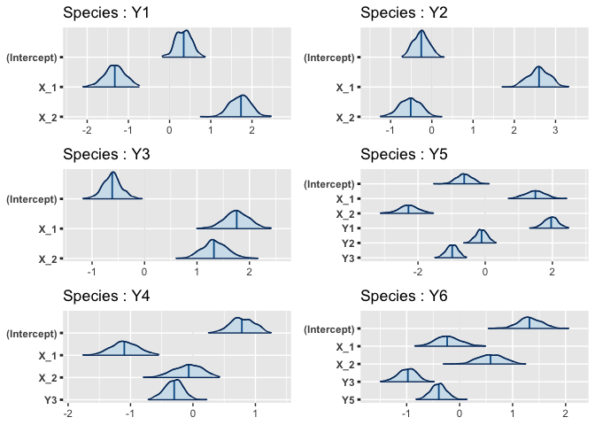
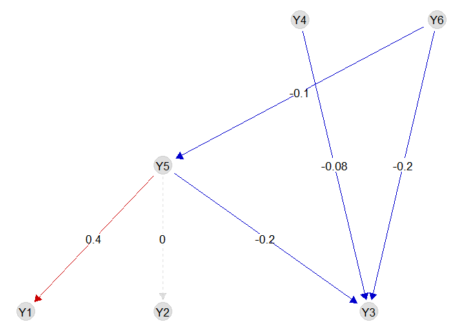
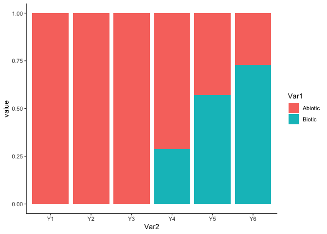

R package ‘webSDM’
================
Giovanni Poggiato
09/11/22

# 

[](http://www.repostatus.org/#active)
[](https://www.gnu.org/licenses/gpl-3.0)

# webSDM - including known trophic interactions in SDM

webSDM implements the trophic SDM model described in Poggiato et al.,
“Integrating trophic food webs in species distribution models improves
ecological niche estimation and prediction”. Trophic SDM integrate a
known trophic interaction network in SDM, thus oroviding more realistic
and ecologically sound predictions. We here after present a quick
introduction to some of the feature of the package, but we refer to the
vignettes and the help functions for a more complete documentation of
our package.

## Installing the R package

``` r
library(devtools)
## Le chargement a nécessité le package : usethis
# Run to install webSDM
install_github("giopogg/webSDM")
## Skipping install of 'webSDM' from a github remote, the SHA1 (d3d72465) has not changed since last install.
##   Use `force = TRUE` to force installation
library(webSDM)
## Registered S3 method overwritten by 'GGally':
##   method from   
##   +.gg   ggplot2
library(ggplot2)
library(rstanarm)
## Le chargement a nécessité le package : Rcpp
## This is rstanarm version 2.21.3
## - See https://mc-stan.org/rstanarm/articles/priors for changes to default priors!
## - Default priors may change, so it's safest to specify priors, even if equivalent to the defaults.
## - For execution on a local, multicore CPU with excess RAM we recommend calling
##   options(mc.cores = parallel::detectCores())
```

## Fit a trophic SDM to data

Fitting a trophic SDM require the species distribution data, the
environmental covariates and a known trophic interaction network.  
We load a simulated datasets, where Y contains the species distribution
data (a site x species matrix), X the environmental covariates (a sites
x covariates matrix) and G is an `igraph` object describing the
interaction network (with links going from predators to prey). We
specify, for every species, a quadratic relationship with respect to the
environment, and we fit a model assuming bottom-up control (i.e.,
predators are modelled as a function of preys). We fit the trophicSDM in
the Bayesian framework.

``` r
data(X, Y, G)

m = trophicSDM(Y = Y, X = X, G = G, env.formula = "~ X_1 + X_2",
               family = binomial(link = "logit"),
               mode = "prey", method = "stan_glm")
```

### Inferred coefficients

We can see the formula of each glm in the argument `$form.all`

``` r
m$form.all
## $Y1
## [1] "y ~ X_1 + X_2"
## 
## $Y2
## [1] "y ~ X_1 + X_2"
## 
## $Y3
## [1] "y ~ X_1 + X_2"
## 
## $Y5
## [1] "y ~ X_1 + X_2+Y1+Y2+Y3"
## 
## $Y4
## [1] "y ~ X_1 + X_2+Y3"
## 
## $Y6
## [1] "y ~ X_1 + X_2+Y3+Y5"
```

We can have a first look to regression coefficients using the function
`plot`.

``` r
plot(m)
```

<!-- -->

We can access to the regression coefficients (eventually standardised)
with the function `coef`.

``` r
coef(m, standardise = T, level = 0.9)
## $Y1
##               estimate         5%        95%
## (Intercept)  0.3356480  0.3356480  0.3356480
## X_1         -0.1980409 -0.2546844 -0.1392262
## X_2          0.2573000  0.2056437  0.3131806
## 
## $Y2
##               estimate         5%         95%
## (Intercept) -0.2657684 -0.2657684 -0.26576835
## X_1          0.3844270  0.3229825  0.45524387
## X_2         -0.0716046 -0.1299509 -0.01609685
## 
## $Y3
##               estimate         5%        95%
## (Intercept) -0.6151417 -0.6151417 -0.6151417
## X_1          0.2673097  0.2131813  0.3253654
## X_2          0.1995619  0.1378760  0.2697374
## 
## $Y5
##                estimate          5%         95%
## (Intercept) -0.61340430 -0.61340430 -0.61340430
## X_1          0.20163096  0.14485933  0.26338063
## X_2         -0.30480813 -0.36835133 -0.24049912
## Y1           0.44004828  0.37312719  0.51568662
## Y2          -0.02433073 -0.08636042  0.03387327
## Y3          -0.21123148 -0.26560906 -0.15329877
## 
## $Y4
##                estimate          5%         95%
## (Intercept)  0.78480621  0.78480621  0.78480621
## X_1         -0.17609957 -0.23260354 -0.11722914
## X_2         -0.01297398 -0.06822776  0.04543659
## Y3          -0.07202979 -0.13198333 -0.01167572
## 
## $Y6
##                estimate          5%         95%
## (Intercept)  1.31804303  1.31804303  1.31804303
## X_1         -0.03160237 -0.09022924  0.03024488
## X_2          0.08668384  0.02953393  0.15043882
## Y3          -0.24074426 -0.30346007 -0.17924240
## Y5          -0.09962656 -0.16231573 -0.04517635
```

We can visualise the biotic coefficients with the function
`plotG_inferred`

``` r
plotG_inferred(m)
```

<!-- -->

We can also visualise the importance of each (set of) variable with the
function \`computeVariableImportance’

``` r
VarImpo = computeVariableImportance(m, 
                                    groups = list("Abiotic" = c("X_1","X_2"),
                                                  "Biotic" = c("Y1","Y2", "Y3", "Y4", "Y5", "Y6")))
VarImpo = apply(VarImpo, 2, function(x) x/(x[1]+x[2]))
tab = reshape2::melt(VarImpo)
tab$Var2 = factor(tab$Var2, levels = colnames(Y))
ggplot(tab, aes(x = Var2, y = value, fill = Var1)) + geom_bar(stat="identity") +
  theme_classic()
```

<!-- -->

### Local objects

We can access each local model in the field `$model` and then select a
given local model, that can be analysed using some the implemented
methods

``` r
m$model$Y5
## ==================================================================
## Local SDMfit for species Y5 with no penalty , fitted using stan_glm 
## ==================================================================
## * Useful S3 methods
##     print(), coef(), plot(), predict()
##     $model gives the stanreg class object 
## ==================================================================
```

### Predictions

We can predict with a fitted trophic SDM in multiple ways. The most
straightforward way is to use the function `predict`. We can for example
obtain 50 draws from the posterior predictive distribution of species
(pred_samples = 50) using predicted presence-absences of species to
predict their predators (prob.cov = TRUE). When we don’t specify Xnew,
the function sets Xnew = X by default. We can thus obtain the fitted
values of the model and compute goodness of fit metrics. Notice that
other metrics like AIC or loo are also available.

``` r
Ypred = predict(m, fullPost = FALSE, pred_samples = 50, prob.cov = FALSE)
# predict returns a list contaning for each species the predictive samples at each site
# But since we specified fullPost = FALSE it only give back the predictive mean and quantiles 
Ypred = do.call(cbind,
                lapply(Ypred, function(x) x$predictions.mean))

Ypred = Ypred[,colnames(Y)]
evaluateModelFit(m, Ynew = Y, Ypredicted = Ypred)
##         auc       tss species
## 1 0.6733913 0.2828523      Y1
## 2 0.7049275 0.3116298      Y2
## 3 0.6691285 0.2793124      Y3
## 4 0.5994943 0.1731849      Y4
## 5 0.6134552 0.2028583      Y5
## 6 0.5592781 0.1120330      Y6

m$log.lik
## [1] -3638.462
m$AIC
## [1] 7336.924
loo(m)
## [1] -3650.494
```

We can also evaluate the quality of model predictions using K-fold
cross-validation:

``` r
CV = trophicSDM_CV(m, K = 3, prob.cov = T, run.parallel = FALSE)
# Transfom in a table
Ypred = CV$meanPred
# Re order columns
Ypred = Ypred[,colnames(Y)]
evaluateModelFit(m, Ynew = Y, Ypredicted = Ypred)
```

We can now evaluate species probabilities of presence for the
enviromental conditions X_1 = 0.5 and X_2 = 0.5.

``` r
Pred = predict(m, Xnew = data.frame(X_1 = 0.5, X_2 = 0.5), fullPost = F)
t(do.call(cbind, Pred))
##    predictions.mean predictions.q025 predictions.q975
## Y1 0.6306295        0.5982156        0.6584504       
## Y2 0.6876509        0.6581885        0.7243871       
## Y3 0.7180076        0.6926365        0.7435011       
## Y5 0.381138         0.08540156       0.7599537       
## Y4 0.4838677        0.4424159        0.5591465       
## Y6 0.6237136        0.4813146        0.8234734
```

We can also obtain an estimation of the fundamental niche, that
corresponds, in the bottom-up approach, to the probability of presence
of a species given that its preys are present. We can for example
compute the probability of presence of species for the enviromental
conditions X_1 = 0.5 and X_2 = 0.5 assuming all their preys to be
present.

``` r
Ypred = predictFundamental(m, fullPost = FALSE, pred_samples = 100, Xnew = data.frame(X_1 = 0.5, X_2 = 0.5))
```

### Frequentist approach

Notice that we can also fit a trophic SDM in the frequentist approach.

``` r
m = trophicSDM(Y = Y, X = X, G = G, env.formula = "~ X_1 + X_2",
               family = binomial(link = "logit"),
               mode = "prey", method = "glm")
## [1] "--- Species Y1 ---"
## [1] "--- Species Y2 ---"
## [1] "--- Species Y3 ---"
## [1] "--- Species Y5 ---"
## [1] "--- Species Y4 ---"
## [1] "--- Species Y6 ---"
```

All the above-mentioned functions are also available in the frequentist
framework, with adaptations when necessary (e.g. coefficients are
significant or not depending on the p-values instead of the credible
interval). However, error propagation is not available and we can only
obtain one prediction for each species and site, instead of multiple
samples in the Bayesian case. ### Penalisation We can infer a sparse
model by specifying `penal = "horshoe"` if we set `method = "stan_glm"`
(i.e. in the Bayesian framework), or `penal = "elasticnet"` if we set
`method = "glm"` (i.e. in the frequentist framework).

``` r
m = trophicSDM(Y = Y, X = X, G = G, env.formula = "~ X_1 + X_2",
               family = binomial(link = "logit"),
               mode = "prey", method = "glm", penal = "elasticnet")
## [1] "--- Species Y1 ---"
## [1] "--- Species Y2 ---"
## [1] "--- Species Y3 ---"
## [1] "--- Species Y5 ---"
## [1] "--- Species Y4 ---"
## [1] "--- Species Y6 ---"

m = trophicSDM(Y = Y, X = X, G = G, env.formula = "~ X_1 + X_2",
               family = binomial(link = "logit"),
               mode = "prey", method = "stan_glm", penal = "horshoe")
## [1] "--- Species Y1 ---"
## [1] "--- Species Y2 ---"
## Warning: Bulk Effective Samples Size (ESS) is too low, indicating posterior means and medians may be unreliable.
## Running the chains for more iterations may help. See
## https://mc-stan.org/misc/warnings.html#bulk-ess
## Warning: Tail Effective Samples Size (ESS) is too low, indicating posterior variances and tail quantiles may be unreliable.
## Running the chains for more iterations may help. See
## https://mc-stan.org/misc/warnings.html#tail-ess
## [1] "--- Species Y3 ---"
## Warning: Bulk Effective Samples Size (ESS) is too low, indicating posterior means and medians may be unreliable.
## Running the chains for more iterations may help. See
## https://mc-stan.org/misc/warnings.html#bulk-ess
## [1] "--- Species Y5 ---"
## Warning: Bulk Effective Samples Size (ESS) is too low, indicating posterior means and medians may be unreliable.
## Running the chains for more iterations may help. See
## https://mc-stan.org/misc/warnings.html#bulk-ess

## Warning: Tail Effective Samples Size (ESS) is too low, indicating posterior variances and tail quantiles may be unreliable.
## Running the chains for more iterations may help. See
## https://mc-stan.org/misc/warnings.html#tail-ess
## [1] "--- Species Y4 ---"
## Warning: Bulk Effective Samples Size (ESS) is too low, indicating posterior means and medians may be unreliable.
## Running the chains for more iterations may help. See
## https://mc-stan.org/misc/warnings.html#bulk-ess
## [1] "--- Species Y6 ---"
## Warning: Bulk Effective Samples Size (ESS) is too low, indicating posterior means and medians may be unreliable.
## Running the chains for more iterations may help. See
## https://mc-stan.org/misc/warnings.html#bulk-ess
```

### Composite variables

We can include composite variables using the arguments `sp.formula` and
`sp.partition`. We refer to the vignette ‘Composite variable’ for an
exhaustive description of these arguments and how to use them to obtain
any kind of model specification. For example, we can model species as a
function of of their prey richness.

``` r
m = trophicSDM(Y = Y, X = X, G = G, env.formula = "~ X_1 + X_2",
               sp.formula = "richness",
               family = binomial(link = "logit"),
               mode = "prey", method = "glm")
## [1] "--- Species Y1 ---"
## [1] "--- Species Y2 ---"
## [1] "--- Species Y3 ---"
## [1] "--- Species Y5 ---"
## [1] "--- Species Y4 ---"
## [1] "--- Species Y6 ---"
m$form.all
## $Y1
## [1] "y ~ X_1 + X_2"
## 
## $Y2
## [1] "y ~ X_1 + X_2"
## 
## $Y3
## [1] "y ~ X_1 + X_2"
## 
## $Y5
## [1] "y ~ X_1 + X_2+I(Y1+Y2+Y3)"
## 
## $Y4
## [1] "y ~ X_1 + X_2+I(Y3)"
## 
## $Y6
## [1] "y ~ X_1 + X_2+I(Y3+Y5)"
```

## Author

This package is currently developed by Giovanni Poggiato from
Laboratoire d’Ecologie Alpine. It is supported by the ANR GAMBAS. The
framework implemented in this package is described in: “Integrating
trophic food webs in species distribution models improves ecological
niche estimation and prediction” Poggiato Giovanni, Jérémy Andréoletti,
Laura J. Pollock and Wilfried Thuiller. In preparation.
