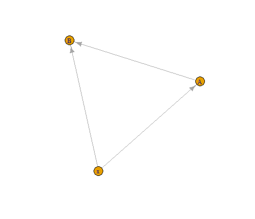
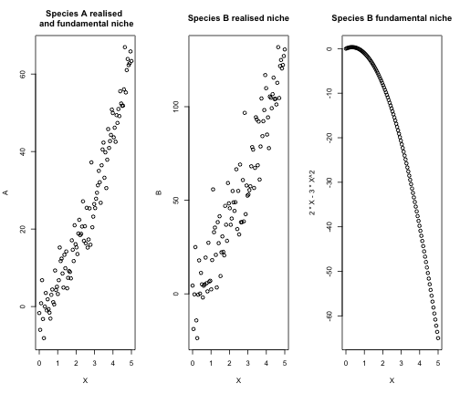
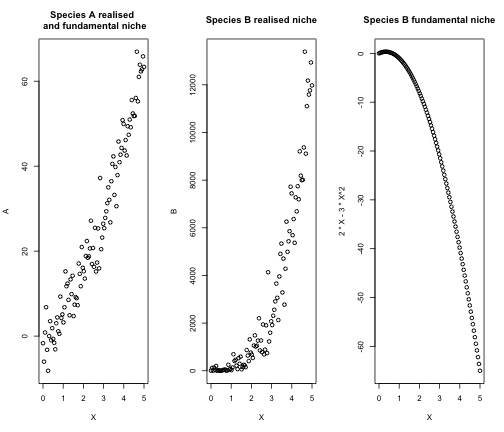
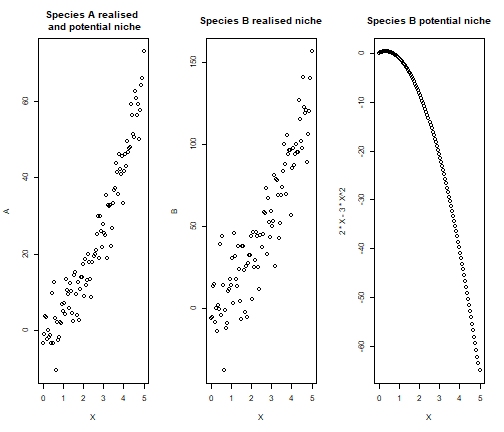

  


## Compare trophic and classical SDMs: difference and equalities
Here, we present the differences between a classic SDM and our trophic SDM, starting from the simplest case when these two approaches coincide to more realistic cases where they do not.

### The simplest case
Let’s consider a very simple case with one environmental covariate $x$, and two species $y_A$ and $y_B$. We assume species $y_A$ to be basal and species $y_B$ to feed on $y_A$. This leads to the following directed acyclic graph that resumes the dependencies across variables, assuming bottom-up control.


```r
library(igraph)
G=graph_from_edgelist(as.matrix(data.frame(from = c("x","x","A"), to =  c("A","B","B"))))
plot(G)
```



We now assume that data on species distributions are continuous observable entities (e.g. basal area, biomass), that we can model with a linear regression. We name $y_{iA}$ and $y_{iB}$ the observations of species $y_A$ and $y_B$, respectively, and we assume that the environment has a quadratic effect on both species.
Therefore, using classical SDMs, model equations are:  
$$
\begin{aligned}
y_{iA} &= \beta^{SDM}_{0A} + \beta^{SDM}_{1A} x_i + \beta^{SDM}_{2A}x_i^2 + \epsilon_{iA}, \ \ \epsilon_{iA} \sim N(0, \sigma_A^{SDM}) \\
y_{iB} &= \beta^{SDM}_{0B} + \beta^{SDM}_{1B} x_i + \beta^{SDM}_{2B}x_i^2 + \epsilon_{iB}, \ \ \epsilon_{iB} \sim N(0, \sigma_B^{SDM})
\end{aligned}
$$
  
Instead, our trophic model includes a dependence of $y_B$ on its prey $y_A$:  
$$
\begin{aligned}
y_{iA} &= \beta^{tSDM}_{0A} + \beta^{tSDM}_{1A} x_i + \beta^{tSDM}_{2A}x_i^2 + \epsilon_{iA}, \ \ \epsilon_{iA} \sim N(0, \sigma_A^{tSDM}) \\
y_{iB} &= \beta^{tSDM}_{0B} + \beta^{tSDM}_{1B} x_i + \beta^{tSDM}_{2B}x_i^2 + \alpha y_A + \epsilon_{iB}, \ \ \epsilon_{iB} \sim N(0, \sigma_B^{tSDM})
\end{aligned}
$$

We hereafter focus on the expectation of the models (corresponding to the predicted values), focusing in particular on species $y_B$ for which the two models are different. For SDMs:  
$$E[y_{iB} | \ x_i] = \beta^{SDM}_{0B} + \beta^{SDM}_{1B} x_i + \beta^{SDM}_{2B}x_i^2 $$
For trophic SDM, we need to condition on a value of $y_{iA}$. We here choose to condition on the expected value of  $y_{iA}$, which corresponds to using predictions from $y_A$ to predict $y_B$ (please not that in this linear model, with Gaussian data and a linear interaction between prey and predator, we have that $E_A[E_B[y_B | \ y_A]] = E_B[y_B | \ E[y_A]]$, which is not necessarily true in other cases).  
We thus have:  
$$E[y_{iB} | \ x_i, E[y_{iA}] ] = \beta^{tSDM}_{0B} + \beta^{tSDM}_{1B} x_i + \beta^{tSDM}_{2B}x_i^2 + \alpha E[y_{iA}] $$
We can rewrite the expected value of $y_B$ only as a function of the environment $x$ only.
$$
\begin{aligned}
E[y_{iB} | \ x_i, E[y_{iA}] ] &= \beta^{tSDM}_{0B} + \beta^{tSDM}_{1B} x_i + \beta^{tSDM}_{2B}x_i^2 + \alpha (\beta^{tSDM}_{0A} + \beta^{tSDM}_{1A} x_i + \beta^{tSDM}_{2A}x_i^2 ) \\
& = \beta^{tSDM}_{0B} + \alpha \beta^{tSDM}_{0A} + ( \beta^{tSDM}_{1B} + \alpha \beta^{tSDM}_{1A}) x_i + (\beta^{tSDM}_{2B} + \alpha \beta^{tSDM}_{2A}) x_i^2 \\
&=  \beta^{SDM}_{0B} + \beta^{SDM}_{1B} x_i + \beta^{SDM}_{2B}x_i^2
\end{aligned}
$$
  
In this very simple case of a linear regression model with a linear interactions between the predator and the preys, the estimation of the regression coefficients is such that
$$\beta^{SDM}_{.B} = \beta^{tSDM}_{.B} + \alpha \beta^{tSDM}_{.A} $$
As a consequence the models estimate the same realised niche, and predictions from trophic and classical SDMs coincide.  
However, our trophic model allows a separation of the direct effect of the environment on $y_B$ (i.e. the fundamental niche of $y_B$) from its indirect effect due to the effect of $y_A$ on $y_B$. In other words, using the jargon of structural equation models, $\beta^{tSDM}_{1B}$ and $\beta^{tSDM}_{2B}$ are the direct effects of the environment on species $y_B$ (i.e. its fundamental niche), the terms  $\alpha \beta^{tSDM}_{1A}$ and $\alpha \beta^{tSDM}_{2A}$ are the indirect effect of the environment on species $y_B$. The sum of these two effects, $\beta^{tSDM}_{1B} + \alpha \beta^{tSDM}_{1A}$ and  $\beta^{tSDM}_{2B} + \alpha \beta^{tSDM}_{2A}$ corresponds to the total effect of the environment on $y_B$, i.e. the realised niche of $y_B$. In this very particular case, SDM can correctly estimate the total effect (the realised niche), but cannot separate the direct and indirect effect of the environment on $y_B$ and thus they do not correctly estimate the fundamental niche.  

#### Simulation
We hereafter present a short example confirming the analytic derivation of these results.

First, we simulate species distribution data accordingly to the directed acyclic graph presented above. Therefore, the environment has a quadratic effect on species $y_A$ and species $y_B$, with a linear effect of $y_A$ on $y_B$.


```r
set.seed(1712)
# Create the environmental gradient
X = seq(0,5,length.out=100)
# Simulate data for the basal species A 
A = 3*X + 2*X^2 + rnorm(100, sd = 5)
# Simulate data for the predator species B
B = 2*X -3*X^2 + 3*A  + rnorm(100, sd = 5)

oldpar = par()
par(mfrow=c(1,3))
plot(X,A, main = "Species A realised \n and fundamental niche")
plot(X,B, main = "Species B realised niche")
plot(X, 2*X -3*X^2, main = "Species B fundamental niche")
```



```r

par(mfrow = oldpar$mfrow)

```

We now run both a classic SDM and a trophic SDM


```r
# For species A, the two models coincide
m_A = lm(A ~ X + I(X^2))

# For species B, the two models are different:

## trophic model
m_trophic = lm(B ~ X + I(X^2) + A)
## classic SDM
m_SDM = lm(B ~ X + I(X^2))
```
We can now test the relationships between the coefficients of SDM and trophic SDM.


```r
# Show the equality of coefficients
all.equal(coef(m_SDM), coef(m_trophic)[-4] + coef(m_trophic)[4]*coef(m_A))
#> [1] TRUE

# Prediction coincide
pred_SDM = m_SDM$fitted.values
pred_trophic = predict(m_trophic, newdata = data.frame(X = X, A = m_A$fitted.values))

all.equal(pred_SDM, pred_trophic)
#> [1] TRUE
```
The coefficient of classic SDM for species $y_B$ are equal to the environmental coefficients of trophic SDM for species $y_B$ plus the indirect effect of the environment on species $y_B$ (given by the product of the biotic term and the environmental coefficients of species $y_A$).
As a consequence, the predictions of both models coincide when the predicted value of species  $y_A$ is used to predict  $y_B$.
However, unlike the traditional SDM, our trophic model allows to retrieve the correct fundamental niche of species 𝑦𝐵

```r
# Fundamental niche infered by SDM 
plot(X, m_SDM$fitted.values, ylim = c(-65, 120), ylab = "B",
     main = "Fundamental niche of yB")

points(X, cbind(1, X, X^2) %*% coef(m_trophic)[-4], col ="red")
points(X,  2*X -3*X^2, col ="blue")
legend(-0.1, 120, legend=c("Fundamental niche inferred by SDM",
                           "Fundamental niche inferred by trophic SDM",
                           "True fundamenta niche"), pch =1,
       col=c("black","red", "blue"), cex = 0.5)
```


## Does this always hold?
We showed that SDM and trophic SDM estimate the same realized niche, and thus lead to the same predictions, when all the following conditions hold:  
  - The relationship between predator and prey is linear  
- Species distribution are continuous abundances  
- The statistical model employed is a linear regression 
- The selected environmental variables are the same for prey and predators  
However, as soon as at least one of the previous conditions does not hold, the estimations of the realised niche (and so model prediction) differ. We hereafter show that releasing just one of these constraints at a time is enough to obtain predictions from trophic SDM that are different, and better, than classical SDMs. Therefore, the example presented above is a very particular case that is useful to understand model similarities, but that rarely occurs in application.

### Non-linear relationship between prey and predator
We hereafter release the conditions on the linearity of the relationship between $y_B$ and $y_A$. Indeed, we now consider that species $y_B$ has a quadratic response to $y_A$. The classic SDM does not change, as we model species as a function of the environment only. Instead, the trophic model for species $y_B$ becomes:  
$$y_{iB}= \beta^{tSDM}_{0B} + \beta^{tSDM}_{1B} x_i + \beta^{tSDM}_{2B}x_i^2 + \alpha y_A^2 + \epsilon_{iB}, \ \ \epsilon_{iB} \sim N(0, \sigma_B^{tSDM})$$
Predictions between trophic SDM and SDM are now different, since:
$$
\begin{aligned}
E[y_{iB} | \ x_i, E[y_{iA}] ] &= \beta^{tSDM}_{0B} + \beta^{tSDM}_{1B} x_i + \beta^{tSDM}_{2B}x_i^2 + \alpha (\beta^{tSDM}_{0A} + \beta^{tSDM}_{1A} x_i + \beta^{tSDM}_{2A}x_i^2 )^2 \\
& = \beta^{tSDM}_{0B} + \alpha(\beta^{tSDM}_{0A})^2+ (\beta^{tSDM}_{1B} + 2\alpha\beta^{tSDM}_{0A}\beta^{tSDM}_{1A}) x_i \\
& \ \ \ \ + (\beta^{tSDM}_{2B} + \alpha (2\beta^{tSDM}_{0A}\beta^{tSDM}_{2A} + (\beta^{tSDM}_{1A})^2))x_i^2 + 2\alpha\beta^{tSDM}_{1A}\beta^{tSDM}_{2A} x_i^3 + \alpha(\beta^{tSDM}_{2A})^2x_i^4 \\
&\neq \beta^{SDM}_{0B} + \beta^{SDM}_{1B} x_i + \beta^{SDM}_{2B}x_i^2
\end{aligned}
$$

In order to correctly infer the realised niche, classic SDMs should be specified with a polynomial of degree 4. As soon as we add multiple environmental variables and link between species, classic SDM should be specified with extremely complex formula, which is unfeasible for real application.

#### Simulation
We provide a simple example to demonstrate the analytic computations with a simulation. We use the same example of above, but we now simulate a quadratic relationship of $y_B$ with respect to $y_A$.


```r
B = 2*X -3*X^2 + 3*A^2  + rnorm(100, sd = 5)

oldpar = par()
par(mfrow=c(1,3))
plot(X,A, main = "Species A realised \n and fundamental niche")
plot(X,B, main = "Species B realised niche")
plot(X, 2*X -3*X^2, main = "Species B fundamental niche")
```



```r
par(mfrow = oldpar$mfrow)

# Fit a trophic SDM
m_trophic = lm(B ~ X + I(X^2) + I(A^2))
```
We now compare the regression coefficients and predictions from the two models


```r
# Show the equality of coefficients
all.equal(coef(m_SDM), coef(m_trophic)[-4] + coef(m_trophic)[4]*coef(m_A))
#> [1] "Mean relative difference: 0.185587"

# Prediction are now different
pred_SDM = m_SDM$fitted.values
pred_trophic = predict(m_trophic, newdata = data.frame(X = X, A = m_A$fitted.values))

all.equal(pred_SDM, pred_trophic)
#> [1] "Mean relative difference: 53.61947"

#Compare R2
cor(B, pred_SDM)^2
#> [1] 0.8339402
cor(B, pred_trophic)^2
#> [1] 0.9605349
```
The relationship between the coefficients of the two models does not hold anymore more, and predictions are now different, with trophic SDM reaching a far better predictive accuracy than classic SDM for species $y_B$ (R2 of 0.83 and 0.96 respectively).

### Non-continuous observable entities (presence-absence, counts) 
Let’s now consider here the case of presence-absences (i.e. binary data), without modifying the other two conditions. Therefore, we use a (generalized) linear model like logistic regression, and we model a linear relationship (at the link level) between predator and prey. Thus, for SDM we have:  
$$
\begin{aligned}
p(y_{iA}= 1) &= \text{logit}^{-1}(\beta^{SDM}_{0A} + \beta^{SDM}_{1A} x_i + \beta^{SDM}_{2A}x_i^2) \\
p(y_{iB} = 1) &= \text{logit}^{-1}(\beta^{SDM}_{0B} + \beta^{SDM}_{1B} x_i + \beta^{SDM}_{2B}x_i^2)
\end{aligned}
$$  
Instead, our trophic model includes a dependence of $y_B$ on its prey $y_A$:  
$$p(y_{iB} = 1) = \text{logit}^{-1} (\beta^{tSDM}_{0B} + \beta^{tSDM}_{1B} x_i + \beta^{tSDM}_{2B}x_i^2 + \alpha y_A)$$
The equality between the models does not hold anymore due to the non linearity of the logit function. Indeed:
$$
\begin{aligned}
E[y_{iB} | \  x_i, E[y_{iA}] ] &= p(y_{iB} = 1 | \ x_i, p(y_{iA} = 1)) \\
&= \text{logit}^{-1}(\beta^{tSDM}_{0B} + \beta^{tSDM}_{1B} x_i + \beta^{tSDM}_{2B}x_i^2 + \alpha \text{logit}^{-1}(\beta^{tSDM}_{0A} + \beta^{tSDM}_{1A} x_i + \beta^{tSDM}_{2A}x_i^2))\\
&\neq \beta^{SDM}_{0B} + \beta^{SDM}_{1B} x_i + \beta^{SDM}_{2B}x_i^2
\end{aligned}
$$
  
#### Simulations
We now confirm this analytic derivation with a simple example. The code is very similar to the previous one, but we now generate binary data from a logistic model.

```r
# Generate the link layer basal species
V_A= 3*X - 2*X^2
# Transform to probability
prob_A = 1/(1 + exp(-V_A))
# Sample the binary data
A = rbinom(n = 100, size = 1, prob = prob_A)
# Same for species B
V_B = -3*X +1*X^2 + 3*A
prob_B = 1/(1 + exp(-V_B))
B = rbinom(n = 100, size = 1, prob = prob_B)

oldpar = par()
par(mfrow=c(1,3))
plot(X,prob_A, main = "Species A realised \n and fundamental niche")
plot(X,prob_B, main = "Species B realised niche")
plot(X, 1/(1+exp(-(-3*X +1*X^2))), main = "Species B fundamental niche")
```


```r

par(mfrow = oldpar$mfrow)
```
We then fit a classic SDM and a trophic SDM

```r
# For species A, the two models coincide
m_A = glm(A ~ X + I(X^2), family = binomial(link = "logit"))

# For species B, the two models are different:
m_trophic = glm(B ~ X + I(X^2) + A, family = binomial(link = "logit"))
```
We now test the relationships between model coefficients and whether the equality of model predictions still holds


```r
# Equality of the coefficient does not hold anymore
all.equal(coef(m_SDM), coef(m_trophic)[-4] + coef(m_trophic)[4]*coef(m_A))
#> [1] "Mean relative difference: 1.098046"

# Predictions do not coincide anymore
pred_SDM = m_SDM$fitted.values
pred_trophic = predict(m_trophic, newdata = data.frame(X = X, A = m_A$fitted.values))

all.equal(pred_SDM, pred_trophic)
#> [1] "Mean relative difference: 0.9825526"

# Predictions are improved by trophic SDM

## AUC of species B for SDM
dismo::evaluate(p = pred_SDM[which(B==1)],
                a = pred_SDM[which(B==0)] )@auc
#> [1] 0.6533333

## AUC of species B for trophic SDM
dismo::evaluate(p = pred_trophic[which(B==1)],
                a = pred_trophic[which(B==0)] )@auc
#> [1] 0.8529167
```
The relationship between the coefficients of the two models does not hold anymore more, and predictions are now different, with trophic SDM that largely improve classic SDM (AUC of species $y_B$ goes from 0.65 to 0.85).

### Non-linear statistical model
We finally show how using a non-linear statistical model leads to different predictions from classical SDMs and a trophic SDM with the example of a random forest. Since we cannot provide any analytic derivation for random forest, we simply provide an example.
Data are simulated exactly as in the very first examples (continuous observable entities).

```r
# Simulate data for the basal species A 
A = 3*X + 2*X^2 + rnorm(100, sd = 5)
# Simulate data for the predator species B
B = 2*X -3*X^2 + 3*A  + rnorm(100, sd = 5)

oldpar = par()
par(mfrow=c(1,3))
plot(X,A, main = "Species A realised \n and fundamental niche")
plot(X,B, main = "Species B realised niche")
plot(X, 2*X -3*X^2, main = "Species B fundamental niche")
```



```r

par(mfrow = oldpar$mfrow)
```

We infer statistical models with random forest

```r
library(randomForest)

# Species A
m_A  = randomForest(A ~ X + I(X^2))

# Species B trophic SDM
m_trophic = randomForest(B ~ X + I(X^2) + A)
# Species B classic SDM
m_SDM <- randomForest(B ~ X + I(X^2))
```

We now compare the predictions from the two models.

```r
# Prediction are now different
pred_SDM = m_SDM$predicted
pred_trophic = predict(m_trophic, newdata = data.frame(X = X, A = m_A$predicted))

all.equal(pred_SDM, pred_trophic)
#> [1] "Mean relative difference: 0.08021014"

#Compare R2
cor(B, pred_SDM)^2
#> [1] 0.8075415
cor(B, pred_trophic)^2
#> [1] 0.8670482
```

Predictions from the model are different, and trophic SDM has a larger R2 than classical SDMs.

