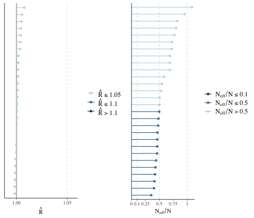
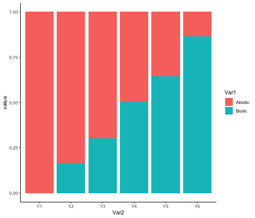
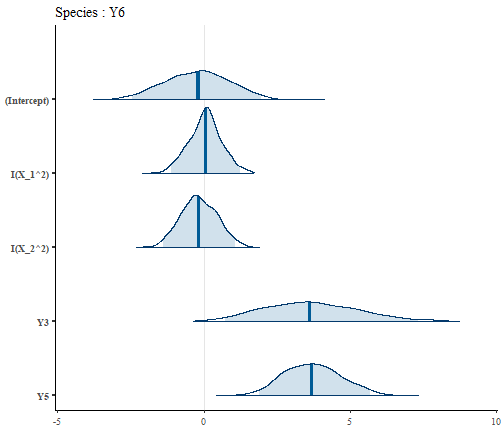

In this vignette we explain how to fit, evaluate and interpret a trophic species distribution model (trophic SDM). Trophic SDM is a statistical model to model the distribution of species accounting for their known trophic interactions. We refer to Poggiato et al., "Integrating trophic food webs in species distribution models improves ecological niche estimation and prediction", in preparation for the full description of trophic SDM.

## Install and load webSDM

```r
library(devtools)
# Run to install webSDM
# install_github("giopogg/webSDM")
library(webSDM)
library(bayesplot)
library(gridExtra)
library(reshape2)
library(ggplot2)
library(loo)
set.seed(1234)
```


## Simulate data
For illustrative purposes, we use simulated data for which we know the parameter values. We thus simulate a trophic interaction network and species distribution for six species, whose names are ordered accordingly to their trophic level (Y1 being basal and Y6 being at the highest trophic position). We simulate data with a stronger dependence on the abiotic variables for species in lower trophic levels, and increasing dependence on the biotic terms (i.e., their preys) for species with a higher trophic level. We will then use trophic SDM and see if the model can retrieve this simulate process and the species fundamental niches.

### Create trophic interaction network
We first create the trophic interaction network. The network needs to be a directed acyclic graph (DAG), with arrows pointing from predator to prey. We thus simulate an interaction network such that species only have prey in a lower trophic position.


```r
# Set number of species
S = 6
# Create the adjacency matrix of the graph
A = matrix(0,nrow=S,ncol=S)

# Ensure that the graph is connected
while(!igraph::is.connected(igraph::graph_from_adjacency_matrix(A))){
  A = A_w = matrix(0,nrow=S,ncol=S)
  # Create links (i.e. zeros and ones of the adjacency matrix)
  for(j in 1:(S-1)){
    A[c((j+1):S),j] = sample(c(0,1), S-j, replace = T)
  }
  # Sample weights for each link
  #A_w[which(A != 0)] = runif(1,min=0,max=2)
}

colnames(A) = rownames(A) = paste0("Y",as.character(1:S))
# Build an igraph object from A
G = igraph::graph_from_adjacency_matrix(A)

plot(G)
```


### Simulate data
We now simulate species distribution at 300 locations along two environmental gradients. We simulate species such that species Y1 to Y3 have a negative dependence to the first environmental variable X_1 and a positive dependence to X_2, viceversa for species Y4 to Y6. Moreover, the strength of the environmental term decreases along the trophic level, while the effect of the prey increases. Finally, preys always have a positive effect on predators.


```r
# Number of sites
n = 500

# Simulate environmental gradient
X_1= scale(runif(n, max = 1))
X_2= scale(runif(n, max = 1))

X = cbind(1, X_1^2, X_2^2)

B = matrix(c(1, 1, 1, 1, 1, 1,
             -2, -2, -2, 2, 2, 2,
             2, 2, 2, -2, -2, -2
             ), ncol = 3)

# Sample the distribution of each species as a logit model as a function of the
# environment and the distribution of preys
Y = V = prob = matrix(0, nrow = n, ncol = S)

for(j in 1:S){
  # The logit of the probability of presence of each species is given by the 
  # effect of the environment and of the preys.
  
  # Create the linear term. As j increases, the weight of the environmental effect 
  # decreases and the biotic effect increases
  eff_bio = seq(0.1, 0.9, length.out = S)[j]
  eff_abio = seq(0.1, 0.9, length.out = S)[S+1-j]
  V[,j]= eff_abio*X%*%B[j,] + eff_bio*Y%*%A[j,]*3
  # Transform to logit
  prob[,j] = 1/(1 + exp(-V[,j]))
  # Sample the probability of presence
  Y[,j] = rbinom(n = n, size = 1, prob = prob[,j])
  
}

# Set names
colnames(Y) = paste0("Y",as.character(1:S))
```

## Fit trophic SDM
Now that we simulate the data, we can fit a species distribution model with the function `trophicSDM`. The function requires the species distribution data `Y` (a sites x species matrix), the environmental variables `X` and an igraph object `G` representing the trophic interaction network. Importantly, `G` must be acyclic and arrows must point from predator to prey. Finally, the user has to specify a formula for the environmental part of the model and the description of the error distribution and link function to be used in the model (parameter `family`), just as with any `glm`.  
By default, `trophicSDM` models each species as a function of their prey (set `mode = "predator"` to model species as a function of their predators) and of the environmental variables (as defined in `env.formula`). Trophic SDM can be also fitted as a function of the summary variables of preys (i.e. composite variables like prey richness), instead of each prey species directly. We cover this topic in the vignette 'Composite variables'.  
The algorithm behind trophic SDM fits a set of generalised linear model (glm), one for each species. These glm can be fitted in the frequentist framework by relying on the function `glm`  (set `method = "glm"`), or in the Bayesian framework by relying on the function `rstanarm` (set `method = "stan_glm"`, the default choice). Model fitting is parallelised if `run.parallel = TRUE`.
These glm can be penalised to shrink regression coefficients (by default the model is run without penalisation). In the Bayesian framework set `penal = "horshoe"` to implement penalised glm using horshoe prior. In the frequentist framework set `penal = "elasticnet"` to implement penalised glm with elasticnet. See the examples in `?trophicSDM`.
Hereafter, we only fit trophic SDM in the Bayesian framework with no penalisation. However, all the functions and analyses (except for MCMC diagnostic) presented in this vignette applies straightforwardly with or without penalisation and in the frequentist framework.

Hereafter we model species as a function of preys and the two environmental covariates in the Bayesian framework without penalisation. We though need to specify the parameters of the MCMC chains. We need to decide how many chains to sample (`chains`), how many samples to obtain per chain (`iter`), and if we wish to see the progress of the MCMC sampling (`verbose`).

```r
iter = 1000
verbose = FALSE
nchains = 2
```

We are now ready to fit a trophic SDM.

```r
X = data.frame(X_1 = X_1, X_2 = X_2)

m = trophicSDM(Y = Y, X = X, G = G, 
               env.formula = "~ I(X_1^2) + I(X_2^2)",
               family = binomial(link = "logit"), 
               method = "stan_glm", chains = nchains, iter = iter, verbose = verbose)
```

### A trophicSDMfit object
The fitted model `m` is of class `"trophicSDMfit"`. We also show here the formulas used to fit the each glm, where each predator is modeled as a function of the preys and of the environmental variables.

```r
m
#> ==================================================================
#> A trophicSDM fit with no penalty, fitted using stan_glm 
#>  with a bottom-up approach 
#>  
#>  Number of species : 6 
#>  Number of links : 10 
#> ==================================================================
#> * Useful fields
#>     $coef 
#> * Useful S3 methods
#>     print(), coef(), plot(), predict(), evaluateModelFit() 
#>     predictFundamental(), plotG(), plotG_inferred(), computeVariableImportance() 
#> * Local models (i.e. single species SDM) can be accessed through 
#>     $model
class(m)
#> [1] "trophicSDMfit"

m$form.all
#> $Y1
#> [1] "y ~ I(X_1^2) + I(X_2^2)"
#> 
#> $Y2
#> [1] "y ~ I(X_1^2)+I(X_2^2)+Y1"
#> 
#> $Y3
#> [1] "y ~ I(X_1^2)+I(X_2^2)+Y1+Y2"
#> 
#> $Y4
#> [1] "y ~ I(X_1^2)+I(X_2^2)+Y1+Y3"
#> 
#> $Y5
#> [1] "y ~ I(X_1^2)+I(X_2^2)+Y1+Y3+Y4"
#> 
#> $Y6
#> [1] "y ~ I(X_1^2)+I(X_2^2)+Y3+Y5"
```

## Analyse a fitted trophicSDM
The field `$model` contains all the the single species glm (i.e., all the local models). `$data` and `trophicSDM` contains informations on the data and choices to fit the model respectively. `$form.all` contains the formula used to fit each glm (i.e., both abiotic and biotic terms). `$coef` contains the inferred regression coefficients of the glm for all species. `$AIC` and `$log.lik` are respectively the AIC and log-likelihood of the fitted trophic SDM. Finally, in the Bayesian framework, the field `$mcmc.diag` contains the convergence diagnostic metrics of the MCMC chains for each species.

In this vignette, we first ensure that the MCMC chains correctly converged. Then, we analyse the inferred model, by focusing in particular on the effect of the biotic versus abiotic terms. We then analyse the predictive performances of the model (comparing it to environment-only SDM) and use it to predict the species fundamental niches. 

### MCMC convergence
First, we can have a look at effective sample size to total sample size and of the potential scale reduction factor (aka 'R hat') for each species. Each line corresponds to a given parameter.


```r
# Plot mcmc potential scale reduction factor (aka rhat)
p1 = mcmc_rhat(m$mcmc.diag$rhat)
# Plot mcmc ratio of effective sample size to total sample size
p2 = mcmc_neff(m$mcmc.diag$neff.ratio)

grid.arrange(p1, p2, ncol = 2)
```



We observe that the effective sample sizes are very close to the theoretical value of the actual number of samples, as the ratio is close to 1. In few cases the ratio is lower, and we might consider running the chains for longer, or thin them, to improve convergence. This indicates that there is very little autocorrelation among consecutive samples. The potential scale reduction factors are very close to one, which indicates that two chains gave consistent results.
We can have a closer look to the MCMC chains by looking at the traceplots of the parameters of a given model, for example here for species Y5 who feeds on species Y1, Y2, Y3 and Y4. To do so, we first assess the local model of species Y5, and in particular its field `$model` that gives us the output of the function `stan_glm`. We can then exploit the plot method of this object.

```r
plot(m$model$Y5$model, "trace")
```


Again, we see that the chains mix very well and that there's little autocorrelation among samples within the same chain.

### Parameter estimates and interpretation
We now analyse the estimates of the regression coefficients. We can have a first glance of the regression coefficients with the function plot. This function plots the posterior distribution of the regression coefficients of each species.

```r
plot(m)
```


We can visually see that the regression coefficients for the environmental part of the model match the simulated parameters, as species Y1 to Y3 have a positive response to X_1 and a negative one to X_2, viceversa for species Y3 to Y6. We also remark that the environmental coefficients are less important for basal species than for predators. Indeed, the posterior mean of the regression coefficients of the environmental part gets closer to zero and their posterior distribution tend to overlap zero more and more as we move from species Y1 to species Y6.  We can quantify this visual assessment by looking at the posterior mean and quantile of the regression coefficients. The parameter `level` set the probability of the quantile (default 0.95).

```r
coef(m, level = 0.9)
#> $Y1
#>                  mean         5%       95%
#> (Intercept)  1.193315  0.8631366  1.551786
#> I(X_1^2)    -2.153769 -2.4827322 -1.854351
#> I(X_2^2)     1.904532  1.5618766  2.281827
#> 
#> $Y2
#>                   mean          5%        95%
#> (Intercept)  0.4378192 -0.05096073  0.9425659
#> I(X_1^2)    -1.3103497 -1.64827655 -0.9781233
#> I(X_2^2)     1.6693748  1.28262664  2.0953004
#> Y1           1.1014760  0.60271353  1.6253656
#> 
#> $Y3
#>                   mean         5%       95%
#> (Intercept)  0.9246159  0.3048754  1.537713
#> I(X_1^2)    -1.3782372 -1.7729318 -1.011603
#> I(X_2^2)     1.2837309  0.8501504  1.799605
#> Y1           0.8750454  0.2487845  1.523552
#> Y2           1.3356857  0.7836524  1.874160
#> 
#> $Y4
#>                  mean         5%        95%
#> (Intercept) -0.149971 -0.9501498  0.6711274
#> I(X_1^2)     1.132746  0.7019883  1.5938620
#> I(X_2^2)    -1.138931 -1.5981180 -0.6976561
#> Y1           2.550784  1.6477388  3.4849039
#> Y3           2.000125  1.2299528  2.9196692
#> 
#> $Y5
#>                   mean          5%        95%
#> (Intercept)  0.5543470 -0.78446747  2.0315709
#> I(X_1^2)     0.9714739  0.01583068  1.9503350
#> I(X_2^2)    -1.4183446 -2.61590362 -0.2213468
#> Y1           2.9289062  0.28313833  6.4031659
#> Y3           4.6412922  1.98733697  7.6986728
#> Y4           2.0493295  0.68591358  3.5493089
#> 
#> $Y6
#>                   mean         5%       95%
#> (Intercept) -0.2653839 -2.0546623 1.7166369
#> I(X_1^2)     0.1022363 -0.8775113 0.9815609
#> I(X_2^2)    -0.2503882 -1.2390232 0.8521640
#> Y3           3.8033136  1.3748090 6.6390156
#> Y5           3.6530362  1.9951208 5.4587375
```

Notice that regression coefficients are directly available in the field `$coef` of an object trophicSDMfit (with `level = 0.95`). As we previously hinted, we see that the estimate of the regression coefficients of the environmental part get closer and closer to zero with credible interval that often overlap zero (implying they are not significant with a confidence level of 10%) for species with a higher trophic level. In order to be able to correctly quantify the effect of the different predictors across species (i.e., their relative importance), we need to standardise the regression coefficients (see Grace et al. 2018). To do so, we need to set `standardise = TRUE`. 

```r
coef(m, level = 0.9, standardise = T)
#> $Y1
#>               estimate         5%        95%
#> (Intercept)  1.1933152  1.1933152  1.1933152
#> I(X_1^2)    -0.6032735 -0.6954163 -0.5194061
#> I(X_2^2)     0.5524401  0.4530474  0.6618806
#> 
#> $Y2
#>               estimate          5%        95%
#> (Intercept)  0.4378192  0.43781923  0.4378192
#> I(X_1^2)    -0.3967764 -0.49910135 -0.2961777
#> I(X_2^2)     0.5234732  0.40219885  0.6570325
#> Y1           0.1815471  0.09934023  0.2678954
#> 
#> $Y3
#>               estimate          5%        95%
#> (Intercept)  0.9246159  0.92461585  0.9246159
#> I(X_1^2)    -0.4018688 -0.51695451 -0.2949649
#> I(X_2^2)     0.3876289  0.25670715  0.5433997
#> Y1           0.1388822  0.03948565  0.2418093
#> Y2           0.2027708  0.11896649  0.2845168
#> 
#> $Y4
#>               estimate         5%        95%
#> (Intercept) -0.1499710 -0.1499710 -0.1499710
#> I(X_1^2)     0.4526599  0.2805236  0.6369279
#> I(X_2^2)    -0.4713231 -0.6613485 -0.2887107
#> Y1           0.5548413  0.3584128  0.7580292
#> Y3           0.3802667  0.2338405  0.5550919
#> 
#> $Y5
#>               estimate           5%         95%
#> (Intercept)  0.5543470  0.554346969  0.55434697
#> I(X_1^2)     0.2802264  0.004566439  0.56258369
#> I(X_2^2)    -0.4236835 -0.781414685 -0.06612002
#> Y1           0.4598741  0.044456182  1.00537537
#> Y3           0.6369546  0.272735138  1.05653878
#> Y4           0.1881906  0.062987653  0.32593412
#> 
#> $Y6
#>                estimate          5%        95%
#> (Intercept) -0.26538390 -0.26538390 -0.2653839
#> I(X_1^2)     0.03710176 -0.31845069  0.3562105
#> I(X_2^2)    -0.09409905 -0.46564058  0.3202540
#> Y3           0.65666409  0.23736872  1.1462645
#> Y5           0.17503112  0.09559397  0.2615493
```

This results confirms the previous analysis. We can analyse the relative importance of different group of variables with the function `computeVariableImportance`. This function can take as input the definition of groups of variables in the argument `groups` (by default, with `groups = NULL`, each explanatory variable is a different group). The variable importance of groups of variables is computed as the standardised regression coefficients summed across variable of the same group.  
We hereafter use this function to compute the relative importance of the abiotic versus biotic covariates.

```r
VarImpo = computeVariableImportance(m, 
                                    groups = list("Abiotic" = c("X_1","X_2"),
                                                     "Biotic" = c("Y1","Y2", "Y3", "Y4", "Y5", "Y6")))
VarImpo = apply(VarImpo, 2, function(x) x/(x[1]+x[2]))
tab = reshape2::melt(VarImpo)
tab$Var2 = factor(tab$Var2, levels = colnames(Y))
ggplot(tab, aes(x = Var2, y = value, fill = Var1)) + geom_bar(stat="identity") +
  theme_classic()
```



We clearly see that our model correctly retrieved the simulated pattern, with the importance of biotic variables with respect to the abiotic ones becomes greater as the trophic level increases.

Finally, we can visualise the effect of each trophic interactions with the function `plotG_inferred`, which plots the metaweb `G` together with the variable importance (i.e. the standardised regression coefficient) of each link. The parameter `level` sets the confidence level with which coefficients are deemed as significant or non-significant.

```r
plotG_inferred(m, level = 0.9)
```


We see that the model correctly retrieves that preys have a posite effect on the predators and that this effect becomes more important for predators at higher trophic positions.

### Analysis of local models

In order to examine the package and practice with it, we here show how to easily manipulate local models, i.e. each glm (that can be seen as a  single species SDMs), the smallest pieces of trophic SDM. These local models belong to the class "SDMfit", for which multiple methods exists. We hereafter show how to some of these methods for species Y6.

```r
SDM = m$model$Y6

# The formula used to fit the model
SDM$form.all
#> [1] "y ~ I(X_1^2)+I(X_2^2)+Y3+Y5"

# The inferred model
plot(SDM)
```



```r

# The regression coefficients
coef(SDM, level = 0.9, standardise = T)
#>                estimate          5%        95%
#> (Intercept) -0.26538390 -0.26538390 -0.2653839
#> I(X_1^2)     0.03710176 -0.31845069  0.3562105
#> I(X_2^2)    -0.09409905 -0.46564058  0.3202540
#> Y3           0.65666409  0.23736872  1.1462645
#> Y5           0.17503112  0.09559397  0.2615493
```

We can also predict the probability of presence of species Y6 at a site with X_1 = 0.5, X_2 = 0.5, assuming its preys to be present present.

```r
preds = predict(SDM, newdata = data.frame(X_1 = 0.5, X_2 = 0.5, Y3 = 1, Y5 = 1))

# Posterior mean of the probability of presence
mean(preds$predictions.prob)
#> [1] 0.9979847
```

We see that the species has a high probability of presence in this environmental conditions when its prey are present.

## Predictions with trophic SDM

We showed how to fit and analyse a trophic SDM and how to predict a single species (Y6 in the previous section), when we can fix the distribution of its prey. However, the distribution of prey is typically unavailable when we want to predict the distribution of species at unobserved sites and/or under future environmental conditions.   Intuitively, in a simple network of two trophic level we would need to predict the prey first and use these predictions to predict the predator. To generalize this idea to complex networks, we predict species following the topological ordering of the metaweb. This order that exists for every DAG guarantees that when predicting a given species, all its prey will have already been predicted.  
The function `predict` computes the topological order of species, and then predicts them sequentially. As any `predict` function, it takes into account the values of the environmental variables in the argument `Xnew`. We can provide to the function the number of samples from the posterior distribution.

```r
pred = predict(m, Xnew = data.frame(X_1 = 0.5, X_2 = 0.5), pred_samples = 100)

dim(pred$Y2)
#> [1]   1 100
```

By default, the function `predict` transforms the probability of presence of prey in presence-absence, and then use these presence-absences to predict the predator. However, we can use directly the probability of presence of prey by setting `prob.cov = TRUE`.

Pred is a list containing the posterior distribution of the predicted probability of presence of each species (i.e., number of sites x pred_samples). Notice that we can ask the function to directly provide a summary of the posterior distribution (i.e. posterior mean and 95% quantiles) of the probabilities of presence by setting `fullPost = FALSE`. As for `trophicSDM`, we can choose to parallelise some parts of the `predict` function by setting `run.parallel = TRUE` (which can speed up computational times).


```r
pred = predict(m, Xnew = data.frame(X_1 = 0.5, X_2 = 0.5), pred_samples = 100, 
               fullPost = FALSE, run.parallel = FALSE)

pred$Y2
#> $predictions.mean
#>         1 
#> 0.7984008 
#> 
#> $predictions.q025
#>         1 
#> 0.5854847 
#> 
#> $predictions.q975
#>         1 
#> 0.8850332
```

## Model evaluation
We now want to evaluate how well the model fits the data and how well it generalises to new data with respect to classical SDM. We thus first run a classical SDM, by providing an empty graph to `trophicSDM`. Then, we will compare model AIC and their predictive performances both on the training data and in cross-validation. Notice that when we compare classical SDM and trophic SDM it is important to account for the fact that trophic SDM have a higher number of parameters, and will therefore have, by default, a higher fit on the the training data. 


```r
empty_graph = graph_from_adjacency_matrix(matrix(0, nrow = S, ncol = S,
                                          dimnames = list(colnames(Y), colnames(Y))))
m_classic = trophicSDM(Y = Y, X = X,
                       G = empty_graph,
                       env.formula = "~ I(X_1^2) + I(X_2^2)", family = binomial(link = "logit"), 
                       method = "stan_glm", chains = nchains, iter = iter, verbose = verbose)
```
### AIC, loo
We first compare model AIC and an approximation of the leave-one-out cross-validation log-likelihood (loo, see Vehtari, A. et al 2017). AIC penalises the likelihood of the model as a function of the number of model parameter, while loo approximate the likelihood of the model on leave-one out cross validation. Therefore, both these metrics can be used to correctly compare the two approaches

```r

m$AIC
#> [1] 1455.721
m_classic$AIC
#> [1] 1584.531


loo(m)
#> Warning: Found 1 observation(s) with a pareto_k > 0.7. We recommend calling 'loo' again with argument 'k_threshold = 0.7' in order to calculate the ELPD without the assumption that these observations are negligible. This will refit the model 1 times to compute the ELPDs for the problematic observations directly.
#> [1] -707.6043
loo(m_classic)
#> [1] -777.2048
```

We see that our trophic model has a lower AIC and a higher loo, which proves that including prey improves the model.

### Interpolation
We now compare the predictive performance of the two approaches on the training dataset. To do so, we first use the function `predict`, and then the function `evaluateModelFit` to compare how well predictions match the true data.

```r

# Trophic SDM (when Xnew is not specified, predictions are carried on
# the training dataset by setting Xnew = m$data$X)
Ypred = predict(m, fullPost = FALSE)
# Transfom in a table
Ypred = do.call(cbind,
                lapply(Ypred, function(x) x$predictions.mean))
# Re order columns
Ypred = Ypred[,colnames(Y)]
metrics = evaluateModelFit(m, Ynew = Y, Ypredicted = Ypred)


# Classical SDM
Ypred_classic = predict(m, fullPost = FALSE)
Ypred_classic = do.call(cbind,
                lapply(Ypred_classic, function(x) x$predictions.mean))
Ypred_classic = Ypred_classic[,colnames(Y)]
metrics_classic = evaluateModelFit(m, Ynew = Y, Ypredicted = Ypred_classic)

# Mean AUC
mean(metrics$auc)
#> [1] 0.8084933
mean(metrics_classic$auc)
#> [1] 0.7980231

# Mean TSS
mean(metrics$tss)
#> [1] 0.5446994
mean(metrics_classic$tss)
#> [1] 0.5234593
```

On the training dataset models have similar performances, with our trophic model that slightly improves SDM's TSS.

### Cross-validation
We now compare the two approaches in K-fold cross validation with the function `trophicSDM_CV`. This function creates a partition based on the specified number of fold (but can also takes a user-specified partition in the argument `partition`) and run a cross validation. This can take a bit of time. Set `run.parallel = TRUE` if you want to reduce computation time.


```r
# 3-fold cross validation
CV = trophicSDM_CV(m, K = 3, prob.cov = T, iter = 2000,
                   pred_samples = 500, run.parallel = FALSE)
#> [1] "Fold 1 out of 3 \n"
#> [1] "Fold 2 out of 3 \n"
#> [1] "Fold 3 out of 3 \n"
# Transfom in a table
Ypred = CV$meanPred
# Re order columns
Ypred = Ypred[,colnames(Y)]
metrics = evaluateModelFit(m, Ynew = Y, Ypredicted = Ypred)


# Classical SDM

# We specify the same partition for classic SDM so that the two cross-validations are comparable.

CV_classic = trophicSDM_CV(m_classic, K = 3, prob.cov = T, iter = 2000,
                           pred_samples = 500, run.parallel = FALSE,
                           partition = CV$partition)
#> [1] "Fold 1 out of 3 \n"
#> [1] "Fold 2 out of 3 \n"
#> [1] "Fold 3 out of 3 \n"

Ypred_classic = CV_classic$meanPred

Ypred_classic = Ypred_classic[,colnames(Y)]
metrics_classic = evaluateModelFit(m, Ynew = Y, Ypredicted = Ypred_classic)

# Mean AUC
mean(metrics$auc)
#> [1] 0.697824
mean(metrics_classic$auc)
#> [1] 0.6669216

# Mean TSS
mean(metrics$tss)
#> [1] 0.4223416
mean(metrics_classic$tss)
#> [1] 0.3722708
```

The increase in mean AUC and TSS is even higher in 3-fold cross-validation than on the fitted data. As we simulated the data with a strong biotic signal, trophic SDM proves to be a better tool than classic SDM.


## Fundamental niche
We also implemented a function to predict species fundamental niches, defined as the probability of presence of species along the environmental gradient when the biotic constrain is realised, i.e., when all its prey are set to present (vice-versa, when modeling species top-down, when the predator are absent). We here compute the probability of presence of species at environmental conditions X_1= 0.5, X_2 = 0.5 when the preys are available.

```r
preds = predictFundamental(m, Xnew = data.frame(X_1 = 0.5, X_2 = 0.5))
# Take the posterior mean
lapply(preds,mean)
#> $Y1
#> [1] 0.7512132
#> 
#> $Y2
#> [1] 0.835708
#> 
#> $Y3
#> [1] 0.9535799
#> 
#> $Y4
#> [1] 0.9859788
#> 
#> $Y5
#> [1] 0.9998674
#> 
#> $Y6
#> [1] 0.9984503
```

## Author
This package is currently developed by Giovanni Poggiato from Laboratoire d’Ecologie Alpine. It is supported by the ANR GAMBAS. The framework implemented in this package is described in: "Integrating trophic food webs in species distribution models improves ecological niche estimation and prediction" Poggiato Giovanni, Jérémy Andréoletti, Laura J. Pollock and Wilfried Thuiller. In preparation.

## References
Grace, J. B., Johnson, D. J., Lefcheck, J. S., and Byrnes, J. E. K.. 2018. Quantifying relative importance: computing standardized effects in models with binary outcomes. Ecosphere 9(6):e02283.

Vehtari, A., Gelman, A., and Gabry, J. (2017). Practical Bayesian model evaluation using leave-one-out cross-validation and WAIC. Statistics and Computing. 27(5), 1413–1432.
